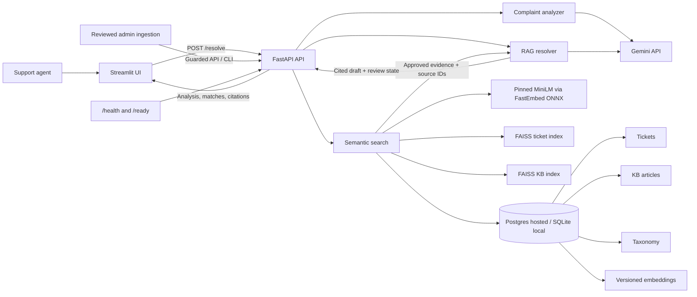

# Intelligent Support Ticket Resolution Assistant

An agent-facing prototype for telecom support. A raw customer complaint is
classified, matched to approved resolved tickets and knowledge-base (KB)
articles, and turned into a cited resolution **draft for agent review**.
Semantic retrieval handles paraphrases that keyword search can miss. The
prototype supports reviewed new ticket classes and updated guidance.

## Architecture



The frontend calls FastAPI over HTTP and never calls Gemini or the database
directly. Separate FAISS indexes rank eligible tickets and KB articles; the
database rechecks approval before evidence is returned. Gemini analyzes the
complaint and drafts steps from bounded retrieved context. Citation validation
checks exact approved source IDs and textual references, but cannot prove that
a step is semantically supported.

## Features and stack

- Typed complaint analysis: intent, category, product, severity, sentiment, and
  review flag, including `other` for unfamiliar classes.
- Pinned `all-MiniLM-L6-v2` embeddings and FAISS semantic retrieval with a
  same-text TF-IDF evaluation baseline.
- Cited RAG with abstention for weak or absent evidence and an explicit
  agent-review warning in the UI.
- Reviewed ticket, KB, and taxonomy updates with versioned database embeddings
  and index refresh.
- FastAPI, SQLAlchemy Core, Pydantic, Google Gen AI SDK, Streamlit, HTTPX,
  FastEmbed/ONNX Runtime, FAISS, and scikit-learn for evaluation.

The synthetic seed contains 12 issue families expanded to 120 tickets and 24
KB articles. Retrieval is limited to 96 resolved, approved tickets and 22
approved KB articles. These examples are suitable for a prototype demonstration,
not a measure of real telecom ticket distribution.

## Run locally

Use Python 3.12 (locally verified with 3.12.14). From the repository root:

```text
python -m venv .venv
```

If `python` is not on your `PATH`, use your installed Python executable for
this first command. Activate the environment:

```text
# Windows PowerShell
.\.venv\Scripts\Activate.ps1

# macOS or Linux
source .venv/bin/activate
```

Then run:

```text
cd backend
python -m pip install -r requirements.txt
python -m app.seed
python -m uvicorn app.main:app --host 127.0.0.1 --port 8000
```

Open `http://127.0.0.1:8000/health` to see `{"status":"ok"}`.
In a second terminal, from the repository root with the same virtual
environment activated, run:

```text
python -m pip install -r frontend/requirements.txt
python -m streamlit run frontend/app.py
```

Open `http://127.0.0.1:8501` for the agent page. It sends the complaint to
FastAPI's `/resolve` route and displays analysis, approved matches, a cited
resolution, and evidence status. It does not call Gemini directly. Set
`API_BASE_URL` in the frontend process environment to use a different backend;
the default is `http://127.0.0.1:8000`. For example, in PowerShell use
`$env:API_BASE_URL = "http://127.0.0.1:8000"` before starting Streamlit.
Run `python -m pytest -q` from `backend/` for backend tests, and
`python -m pytest -q frontend/tests` from the repository root for frontend
tests.

## Evaluation

From `backend/`, run the full deterministic evaluation with:

```text
python -m evaluation.run_evaluation
```

It seeds an isolated temporary database, compares FAISS retrieval with TF-IDF,
checks label-blind fake analysis and scripted RAG contracts, and measures warm
FastAPI route latency. Results are saved under `backend/evaluation/results/` as JSON plus
`evaluation_summary.md`. No Gemini key is needed for this command. The current
metrics rely mainly on small synthetic data and held-out paraphrases; fake-provider
analysis scores are diagnostics, not live Gemini accuracy. An optional small
provider sample can be run separately with `python -m evaluation.run_evaluation
--live`; its environment-specific `live_sample.json` is ignored by Git.

`APP_TITLE` is optional and changes the API title. `.env.example` lists the
available variables. The API reads environment variables and the ignored
repository-root `.env` file. Set `GEMINI_API_KEY` there for analysis and
resolution; never commit the real file.

| Variable | Used by | Purpose |
| --- | --- | --- |
| `DATABASE_URL` | Backend | Postgres URL when set; otherwise local SQLite |
| `GEMINI_API_KEY` | Backend | Gemini credential; never place it in Git |
| `GEMINI_MODEL` | Backend | Optional Gemini model override |
| `ADMIN_API_KEY` | Backend | Optional admin-route key; absent disables updates |
| `CORS_ORIGINS` | Backend | Explicit comma-separated browser origins |
| `SEARCH_TICKET_TOP_K`, `SEARCH_KB_TOP_K` | Backend | Optional retrieval counts |
| `APP_TITLE` | Backend | Optional API title |
| `API_BASE_URL` | Frontend | Backend HTTP(S) origin |

## API routes

Seed the local database with `python -m app.seed` from `backend/`, then start
Uvicorn. `GET /health` checks the process; `GET /ready` checks the database,
search indexes/model, and Gemini configuration. The first readiness or search
request may load the embedding model and build indexes.

`POST /analyze` accepts `{"complaint":"..."}` and returns structured analysis
plus `latency_ms`. `POST /search` accepts the same complaint and optional
`top_k_tickets` and `top_k_kb` (1–20), returning approved evidence and scores.
`POST /resolve` runs analysis, retrieval, and cited RAG generation and returns
analysis, matches, resolution, source IDs, insufficient-evidence status, and
`latency_ms`. Similarity scores are ranking scores, not probabilities.

Optional `POST /admin/tickets`, `POST /admin/kb`, and `POST /admin/taxonomy`
reuse controlled ingestion. Set `ADMIN_API_KEY` in the environment and send it
as `X-Admin-Key`; without a configured key, these routes return 503. The CLI
remains available for local administration. `CORS_ORIGINS` accepts a
comma-separated list of explicit frontend origins; the default only allows
local Streamlit origins on port 8501.

Run `python -m app.api_smoke` from `backend/` for an HTTP smoke test using a
seeded temporary database and fake LLM, without consuming Gemini quota.

## Local data

From `backend/`, after installing its requirements:

```text
python -m app.seed
python -m evaluation.profile
```

The first command validates the synthetic seed files and creates
`backend/data/support.db` using SQLite. Running it again safely skips existing
records. The 12 seed case families expand to 120 stable ticket IDs, with 24
separate KB articles. The second command prints dataset counts and
missing-field counts. Seeding is insert-only in this phase; local seed edits
do not overwrite records already in the database.
An empty `resolution` on an open ticket is expected; resolved tickets must
have a resolution. The database file is local and ignored by Git.

The schema has four tables: `tickets`, `kb_articles`, `taxonomy_values`, and
`embeddings`. Only tickets that are both resolved and approved, and approved
KB articles, are returned by the repository's evidence-only queries. The
embedding table stores reusable, versioned vectors after index building. SQL is
isolated in `backend/app/storage.py`.

SQLite works without an external service. `DATABASE_URL` may override the
default database URL for development; leave it unset for the simplest setup.
The Postgres driver and URL normalization are available for hosted use. Supply
`DATABASE_URL` to select it; Render's `postgresql://` URL and the older
`postgres://` variant both use `psycopg`. The local SQLite fallback is unchanged.

## Semantic search

From `backend/`, seed the local database first, then build the FAISS indexes:

```text
python -m app.seed
python -m app.build_indexes
python -m app.search_demo
```

The first index build downloads a pinned ONNX artifact of the
`sentence-transformers/all-MiniLM-L6-v2` model for local CPU inference through
FastEmbed. Its revision and runtime version are set in `backend/app/config.py`.
The model cache and generated
index files under `backend/data/` are ignored by Git. Normalized vectors are
also stored in the database, so missing or stale index files can be rebuilt
without embedding unchanged records again.

`search_demo` uses an evening broadband complaint by default. Try another:

```text
python -m app.search_demo --query "I cannot surf the web over cellular, but voice chat works." --tickets 3 --kb 3
```

The search returns separate ticket and KB matches with stable source IDs and
similarity scores. Scores rank results; they are not confidence probabilities.
Only resolved and approved tickets and approved KB articles are indexed.
Each returned match is checked against current approval status as well, so a
revoked source is not displayed while an index refresh is pending.
Set `SEARCH_TICKET_TOP_K` and `SEARCH_KB_TOP_K` to positive integers to change
the default result counts (5 each). Controlled Phase 6 ingestion refreshes the
indexes when searchable text or evidence eligibility changes.

## Updating support data

From the repository root, add or update one complete validated JSON record:

```text
python -m backend.app.ingest ticket path/to/ticket.json
python -m backend.app.ingest kb path/to/article.json
python -m backend.app.ingest taxonomy category satellite_backhaul --reviewed-by admin
```

Ticket IDs and KB IDs stay stable; updates keep their original `created_at` and
use a later timezone-aware `updated_at`. Changed KB guidance also increments
`version`. Only resolved, approved tickets and approved KB articles enter
retrieval. The ingestion command rebuilds small FAISS indexes when needed;
unchanged text reuses its durable embedding. New categories require an explicit
reviewed taxonomy command, then complaint analysis can use them on its next call.
Stored severity is `low`/`medium`/`high`/`critical`; stored sentiment is
`positive`/`neutral`/`frustrated`/`negative` (`ANGRY` maps to `negative`).

Run `python -m backend.app.evolving_demo` from the repository root to see an
unknown issue become a reviewed category and searchable ticket, including a
restart check. This demo uses a temporary database and a local embedding model;
it does not call Gemini.

## Example workflow

Enter “My broadband drops every evening around 8 PM and I already restarted
the router twice.” The backend analyzes the complaint, retrieves approved
ticket and KB matches, asks Gemini for a cited draft, validates source IDs,
and returns the draft to Streamlit. The page shows matches, citations,
escalation advice, and backend processing time. An agent must verify each step
against current KB guidance before using it with a customer.

## Evaluation snapshot

The saved Phase 9 run used 16 manually labeled held-out complaints. On the 12
queries with ticket labels, FAISS ticket Recall@5 was 58.3% versus 41.7% for
TF-IDF. On 16 KB-labeled queries, FAISS KB Recall@5 was 93.8% versus 62.5%
for TF-IDF. Scripted RAG checks had 100% cited-ID validity and step citation
coverage, while deliberately revealing that valid IDs can accompany
conflicting or harmful advice. The saved warm fake-provider `/resolve` mean
latency was about 21.6 ms; this excludes cold loading, network time, and
Gemini. The final local suite has 117 backend and 21 frontend tests passing.
See [the full evaluation summary](backend/evaluation/results/evaluation_summary.md)
for denominators, MRR, failure cases, and interpretation.

The complaint-analysis scores come from a label-blind **fake provider**, not
Gemini. The full live Streamlit-to-Gemini pipeline was manually verified both
locally and on Render. Neither synthetic metrics nor one live hosted example
establish production accuracy.

## Render deployment

The prototype is deployed with a [FastAPI backend](https://support-ticket-assistant-api.onrender.com)
and [Streamlit frontend](https://support-ticket-assistant-ui.onrender.com),
Render Postgres, and Gemini. Follow [the Render runbook](docs/RENDER_DEPLOYMENT.md)
for service roots, commands, environment variables, and hosted checks. Do not
put credentials in this repository. The backend's public `/health` and `/ready`
routes returned 200; readiness reported database, search index, embedding
model, and Gemini configuration ready. A hosted `/resolve` call for the example
complaint returned 200 with approved matches and citations in 3,048 ms. The
same complaint completed through the hosted UI, showing analysis, five ticket
matches, five KB articles, cited steps, escalation, sources used, and the agent
review warning; backend processing time in that run was 3,192 ms. A separate
hosted out-of-domain `/resolve` request returned `insufficient_evidence=true`
with no ticket matches. These are individual observations, not a latency
distribution or quality benchmark. Deployed browser preflight requests currently
reject the Streamlit origin; Streamlit's server-side API calls work without
browser CORS permission.

## Limitations, security, and production scale

- Citation IDs prove that the named evidence was retrieved and approved; they
  do not prove semantic entailment, KB precedence, or safety. A valid ID can
  still accompany conflicting or harmful advice. The UI labels the result as
  a draft requiring agent review. Stronger grounding checks and a human
  feedback loop are future work.
- The synthetic corpus and sparse relevance labels limit generalization.
  Similarity scores are ranking signals, not calibrated confidence values.
- The single backend worker protects in-memory index updates with a lock but
  serializes Gemini calls. Hosted readiness and retrieval passed, but Linux
  peak memory, first model download time, restart persistence, and cold-start
  latency have not been separately measured.
- The admin API is disabled without `ADMIN_API_KEY`. A shared key is a
  prototype guard, not identity-based authentication, authorization, or a
  durable audit trail. API logs omit raw complaints; provider errors are
  sanitized. `.env`, local databases, model cache, and FAISS files are ignored.

At greater scale, use managed Postgres with backups, background or queue-based
ingestion, a coordinated vector index or vector database, index/model version
governance, horizontal scaling, rate limits, retry and timeout policies,
tracing and observability, model monitoring, privacy and PII controls, data
retention rules, identity-based RBAC, audit logs, and human review of semantic
support. These are deployment and governance requirements rather than claims
about the present prototype.
