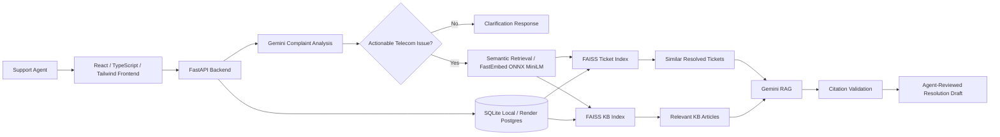
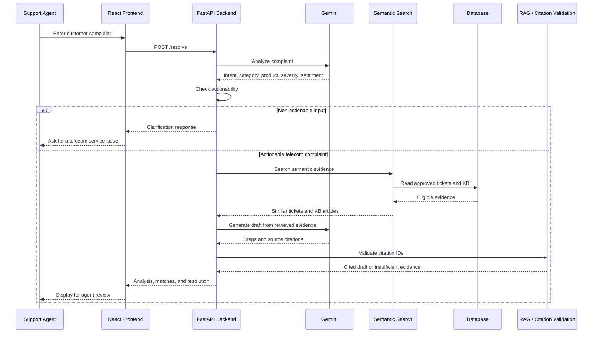

# Intelligent Support Ticket Resolution Assistant

## Project overview

An agent-facing telecom support assistant analyzes a customer complaint, finds semantically similar resolved tickets and
knowledge-base (KB) articles, and drafts cited resolution steps for **agent review**. It supports updated evidence and new
ticket classes. Semantic search helps find related issues that keyword search can miss.

## Architecture

Non-actionable input stops before retrieval/RAG. The frontend calls FastAPI, not Gemini or the database.

## Complaint resolution flow

1. The support agent enters a complaint in React.
2. React sends it to FastAPI.
3. Gemini analyzes the complaint.
4. FastAPI checks whether the complaint is actionable.
5. Non-actionable input returns a clarification.
6. Actionable complaints are matched against approved tickets and KB articles.
7. Gemini drafts steps using retrieved evidence.
8. Citation validation checks source IDs.
9. The frontend displays the result for agent review.

## Features and stack

- Structured complaint analysis: intent, category, product, severity, sentiment, and review status.
- FastEmbed/ONNX `all-MiniLM-L6-v2` embeddings with separate FAISS ticket and KB indexes.
- Cited RAG draft that avoids guessing when evidence is weak and requires agent review.
- Controlled ticket, KB, and taxonomy updates with refreshed search indexes.
- React, TypeScript, Tailwind CSS, Vite, FastAPI, Python, Gemini, SQLAlchemy, Render Postgres, and local SQLite.

The synthetic dataset has **120 tickets and 24 KB articles**; **96 resolved, approved tickets** and **22 approved KB articles** are eligible evidence.

## Run locally

Use Python 3.12. Create a virtual environment with `python -m venv .venv`; activate it with
`.\.venv\Scripts\Activate.ps1` (PowerShell) or `source .venv/bin/activate` (macOS/Linux).
From `backend/`, run `python -m pip install -r requirements.txt`, `python -m app.seed`, then
`python -m uvicorn app.main:app --host 127.0.0.1 --port 8000`.
In a second terminal, from `frontend-react/`, run `npm install` and `npm run dev`.
Backend: `http://127.0.0.1:8000`; frontend: `http://localhost:5173`. Set `VITE_API_BASE_URL` in
`frontend-react/.env` to override the backend origin used by the local Vite proxy.
Complaints are limited to **3000 characters**; longer input is rejected without truncation.

## Environment variables

| Variable | Service | Purpose |
| --- | --- | --- |
| `DATABASE_URL` | Backend | Hosted Postgres URL; unset uses local SQLite |
| `GEMINI_API_KEY` | Backend | Gemini credential |
| `GEMINI_MODEL` | Backend | Optional model override |
| `ADMIN_API_KEY` | Backend | Optional admin key; absent disables admin updates |
| `CORS_ORIGINS` | Backend | Comma-separated allowed browser origins, including the hosted React site |
| `VITE_API_BASE_URL` | React frontend | Public backend HTTP(S) origin |

Keep credentials in the environment or ignored `.env`, never in Git.

## API overview

`GET /health` checks liveness; `GET /ready` checks database, search/model, and Gemini configuration readiness.
`POST /analyze` returns structured analysis; `POST /search` returns similar approved evidence; `POST /resolve` returns a cited
draft or clarifies non-actionable input without retrieval/RAG. Guarded `POST /admin/tickets`, `/admin/kb`, and
`/admin/taxonomy` update reviewed support data.

Similarity scores rank matches; they are not calibrated probabilities.

## Data and retrieval

SQLite is the local default; Render Postgres stores hosted data. Only approved, resolved tickets and approved KB articles
are eligible evidence. Separate FAISS indexes serve tickets and KB; ticket embeddings exclude historical resolution text.
Controlled ingestion can update tickets, KB guidance, and taxonomy and refresh the indexes.

## Evaluation snapshot

- Tickets: FAISS Recall@5 **58.3%**, MRR **0.367**; TF-IDF Recall@5 41.7%.
- KB: FAISS Recall@5 **93.8%**, MRR **0.705**; TF-IDF Recall@5 62.5%.

Scripted citation-ID validity and step citation coverage were **100%** each. The current suite passes 241 backend tests and 20 frontend tests; the frontend production build also passes. Fake-provider analysis metrics are **not Gemini accuracy**; valid citation
IDs do **not** prove semantic support, and similarity scores are not probabilities. From `backend/`, run `python -m evaluation.run_evaluation`;
see [saved results](backend/evaluation/results/) for full outputs.

## Deployment

The [backend](https://support-ticket-assistant-api.onrender.com) and [React frontend](https://support-ticket-assistant.onrender.com)
run on Render with hosted Postgres. The hosted React flow has been verified;
Render Free startup time can still vary. See the [Render deployment guide](docs/RENDER_DEPLOYMENT.md).

## Requirements coverage

- **Architecture diagram:** included above.
- **Executable code:** FastAPI backend, React frontend, evaluation framework, and tests are checked into this repository; deployment instructions are included.
- **Additional exploration:** FAISS retrieval is compared with a TF-IDF baseline using held-out queries.
- **System-health evaluation:** `/health`, `/ready`, automated tests, and evaluation checks cover readiness and core system paths.
- **Production-scale considerations** are summarized under Limitations.
- **Dataset:** synthetic telecom support-ticket scenarios are used.

## Limitations

- Synthetic data and sparse relevance labels limit generalization; live Gemini accuracy has not been formally measured.
- Valid citation IDs do not guarantee that every generated step is fully supported by the source; agents must review every suggested step.
- The shared admin key is not full production RBAC; the prototype uses one backend worker.
- Render Free cold starts can vary.

Production scale would require stronger authentication, scalable indexing/storage, monitoring, and privacy/governance controls.
